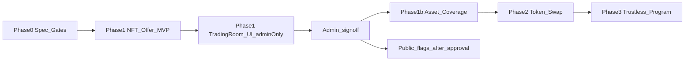
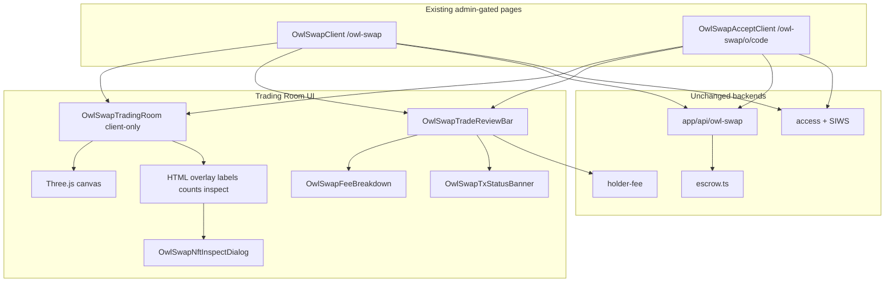

# OwlSwap — Product & Engineering Plan

Sibling to [OwlSend](./OWLSEND_DEV_ANNOUNCEMENT.md). Goal: peer-to-peer NFT trading that is **easier than FoxySwap**, plus a later **token swap** tab, with OwlSend-style clarity (fees, estimate → review → confirm, ledger, holder discounts, mobile-first).

## Implementation status

**Phase 1 admin-only scaffold shipped** — create-offer → share `/owl-swap/o/[code]` → accept, custodial escrow (`OWL_SWAP_ESCROW_SECRET_KEY`), 0.02 SOL taker fee + OwlSend holder discount ladder, classic SPL NFTs (max 5/side), optional SOL sweetener, nav/admin gates.

**Trading Room UI** — planned next as Phase 1 UI completion (§15). Remains **admin-only** with the scaffold until admins finish testing and explicitly approve go-live. Jupiter token swap and non-admin public launch are not included yet.

**Decisions locked**

| Decision | Choice |
|----------|--------|
| Scope | **Both** — NFT P2P first, then token swap (phased) |
| Trade completion | **Create offer → shareable link** (`/owl-swap/o/[code]`) |
| Fees | Low base Owl fee + **same Gen1/Gen2 holder discount ladder as OwlSend** (10–50% off platform fee only) |
| Access / rollout | **Admin-only first** — `OWL_SWAP_PUBLIC` / `NEXT_PUBLIC_OWL_SWAP_PUBLIC` stay false until admins test scaffold + Trading Room and approve public launch. Do not flip public flags as part of UI work. |

Live product URL (target, after public launch): `https://www.owltopia.xyz/owl-swap`

**Admin test surfaces (now):** `/owl-swap`, `/owl-swap/o/[code]`, `/admin/owl-swap` — visible to Owl Vision admins only while public flags are unset.

---

## 1. Why OwlSwap (vs FoxySwap)

FoxySwap (Famous Fox Federation) today:

- P2P NFT trades (not a DEX)
- Up to **10 NFTs / 3 pNFTs** per trade
- Optional **SOL** to balance uneven trades
- **0.1 SOL** flat fee
- Verified collections (~600+)
- Wallet-connect UI that many users find dense / unclear on mobile

OwlSwap should win on:

1. **Clarity** — OwlSend-style live cost estimate, one-job sections, review before sign
2. **Price** — undercut Foxy’s 0.1 SOL with a low Owl fee + holder discounts
3. **Mobile** — ~75% of Owltopia users; 44px targets, single-column flow ([MOBILE_FIRST.md](./MOBILE_FIRST.md))
4. **Trust continuity** — same brand, wallet stack, holder perks as OwlSend / raffles
5. **Link-first** — create offer, copy link/QR, counterparty opens and accepts (no “both online” requirement)

---

## 2. Product phases



**Access note:** Phase 1 scaffold and Trading Room UI stay behind the admin gate until **Admin_signoff**. Public launch is a separate, explicit step (§11).
### Phase 0 — Spec & gates (this doc)

- Fee numbers, limits, trust model, admin rollout gate
- No user-facing UI yet

### Phase 1 — NFT P2P offer MVP (ship first)

**User stories**

1. Maker connects wallet → sees holder fee tier (reuse OwlSend quote pattern)
2. Maker picks **their** NFTs (and optional SOL sweetener)
3. Live estimate: Owl fee (discounted) + rent/network notes
4. Review → Confirm → deposit assets into OwlSwap escrow → offer becomes `open`
5. Maker copies **share link** (+ QR on mobile)
6. Taker opens `/owl-swap/o/[code]` → sees maker side → picks their NFTs (+ optional SOL)
7. Taker Review → Confirm → deposit + complete swap (or single accept tx that settles)
8. Both sides get success UI; swap recorded in **ledger**
9. Maker can **cancel** an open offer (reclaim assets) before accept
10. Offers **expire** after a TTL; reclaim path for maker

**Out of scope for Phase 1**

- Token↔token DEX tab
- Public offer browse marketplace
- Counterparty wallet lock (open link is enough; optional “only this wallet” field is nice-to-have)
- cNFT / Core / complex pNFT paths (Phase 1b)

**Asset support Phase 1**

- Classic SPL NFTs (Metaplex Token Metadata)
- Optional SOL on either side
- Collection allowlist: start with Owltopia Gen1/Gen2 + curated partners; expand like Foxy’s verified list

### Phase 1b — Asset coverage parity with OwlSend send paths

Reuse OwlSend special paths where possible:

| Asset | Approach |
|-------|----------|
| pNFT | Programmable NFT transfer rules; limit ≤3 per side (match Foxy) |
| cNFT | Bubblegum; usually 1 per approval — batch carefully |
| MPL Core | Server prepare pattern like OwlSend `prepare-core-transfer` |
| Frozen / nested | Skip + thaw hints (same eligibility UX as OwlSend) |

Raise limits toward **10 NFTs / 3 pNFTs per side** once tx size + mobile wallet injection headroom are validated (OwlSend already learned packet-size lessons in `lib/owl-send/constants.ts`).

### Phase 2 — Token swap tab (Jupiter)

Same page, second tab (OwlSend NFT | Tokens pattern):

- SOL ↔ SPL via **Jupiter Quote + Swap API** (aggregator; no custom AMM)
- OwlSend UX: amount in → estimate (price impact, route hops, Owl fee) → review → confirm
- Optional Owl platform fee (tiny SOL) with holder discount
- Ledger entries for completed swaps
- No “scatter” — single destination is the user’s wallet

### Phase 3 — Trustless on-chain program (optional upgrade)

Replace custodial escrow with an Anchor (or Pinocchio) atomic swap program:

- Maker deposits to PDA escrow
- Taker accepts in one instruction set that swaps both sides + pays fee
- Cancel / expire on-chain
- Removes “trust Owltopia with custody” for high-value trades

Ship Phase 1 with **documented custodial trust** (same class as prize escrow) so UX can launch; Phase 3 when volume or risk warrants it.

---

## 3. UX (mirror OwlSend)

### Information architecture

| Route | Purpose |
|-------|---------|
| `/owl-swap` | Create offer + My offers + Token tab (Phase 2) |
| `/owl-swap/o/[code]` | Public accept page for a share link |
| `/admin/owl-swap` | Admin preview bench (like `/admin/owl-send`) |

Nav: Community → OwlSwap (gated like OwlSend via `OWL_SWAP_PUBLIC` / `NEXT_PUBLIC_OWL_SWAP_PUBLIC`).

### Single create flow (mobile-first)

1. **Connect** (wallet primary CTA)
2. **Your side** — NFT picker (reuse `WalletNftPicker`), optional SOL amount
3. **Cost** — emerald estimate card (Owl fee after discount; rent/network callouts)
4. **Review offer** → **Confirm & create**
5. **Share** — link, copy, QR; status `open`
6. Mid-flow failure → **resume / reclaim** (OwlSend session-draft spirit)

### Accept flow

1. Open link → load offer (maker assets read-only)
2. Connect → pick **your side**
3. Estimate (fee paid by taker on accept — see fees)
4. Review both sides → Confirm
5. Success + ledger

### Design tokens

Reuse Owltopia: `theme-prime` / `#00ff88`, Bebas `font-display` hero “OwlSwap”, dark `border-white/10 bg-black/40` surfaces, segment toggles. Trading Room (§15) may add subtle purple for the **You receive** chamber only — not a purple-on-white theme. One composition hero; no card clutter in hero.

**Review surface (planned):** immersive Trading Room becomes the create/accept **review** stage; NFT picker + fee clarity stay as today for selection.

### Ease-of-use vs Foxy (explicit)

| Pain (Foxy-like) | OwlSwap fix |
|------------------|-------------|
| Unclear fee until late | Always-visible estimate before first sign |
| Dense multi-panel trade UI | One column: Your side → Cost → Review → Share |
| 0.1 SOL flat | ~0.02 SOL base + holder discounts |
| Hard to resume | Draft + cancel/reclaim + ledger recover |
| Mobile wallet friction | OwlSend batch gaps, absolute API URLs, touch targets |

---

## 4. Fees & holder discounts

**Proposed defaults** (env-overridable; tune before go-live):

| Item | Value |
|------|--------|
| Base Owl fee | **0.02 SOL per completed swap** (5× cheaper than Foxy’s 0.1) |
| Who pays | **Taker on accept** (maker sees “counterparty pays Owl fee” in estimate; maker pays only rent/network to deposit) |
| Discount | Same ladder as OwlSend (`lib/owl-send/holder-discount.ts`) — Gen1/Gen2 hold ranks → 10–50% off **Owl fee only** |
| Non-holder | 0.02 SOL |
| OwlHolder (10%) | 0.018 SOL |
| … | … |
| OwlFounder / GEMBIRD (50%) | 0.01 SOL |

Discount applies to the **taker’s** wallet holder status at accept time (auto-quoted). Document clearly so makers aren’t surprised.

Treasury: reuse `OWL_PLATFORM_FEE_TREASURY_WALLET` (same as OwlSend) unless product wants a dedicated swap treasury later.

Env:

- `OWL_SWAP_FEE_SOL` / `NEXT_PUBLIC_OWL_SWAP_FEE_SOL` (default `0.02`)
- `OWL_SWAP_PUBLIC` / `NEXT_PUBLIC_OWL_SWAP_PUBLIC` (default admin-only)
- `OWL_SWAP_OFFER_TTL_HOURS` (default `72`)
- Escrow: `OWL_SWAP_ESCROW_SECRET_KEY` (server-only; dedicated keypair — do not reuse prize escrow)

---

## 5. Trust model (Phase 1)

**Custodial OwlSwap escrow wallet** (same operational class as [prize escrow](./PRIZE_ESCROW.md)):

1. Maker deposits selected NFTs (+ optional SOL) to escrow; offer status → `open`
2. Taker deposits their side and triggers settlement (server builds/signs escrow release of maker assets to taker + taker assets to maker + fee to treasury)
3. Cancel: maker reclaim while `open`
4. Expire: cron or on-read expiry → reclaimable

**Risks & mitigations**

- Escrow key compromise → dedicated keypair, no shared prize/funds keys, monitor balance, rate limits
- Partial deposit failures → status machine + resume; never mark `open` until maker deposit verified on-chain
- Fake collections → allowlist + DAS verification before accept
- DoS / spam offers → SIWS for create; rate limit; small deposit or max open offers per wallet

**User-facing copy:** “Assets sit in Owltopia OwlSwap escrow until the other side accepts or you cancel.” Phase 3 removes this.

---

## 6. Data model (Supabase)

New migration (suggested name `2xx_owl_swap_offers.sql`):

### `owl_swap_offers`

| Column | Notes |
|--------|--------|
| `id` uuid PK | |
| `short_code` text unique | URL slug for share links |
| `maker_wallet` text | |
| `taker_wallet` text nullable | Set on accept (or optional lock at create) |
| `status` text | `draft` \| `open` \| `completed` \| `cancelled` \| `expired` |
| `maker_sol_lamports` bigint | Sweetener |
| `taker_sol_lamports` bigint | Expected or filled |
| `owl_fee_lamports` bigint | Fee charged at settle |
| `fee_discount_bps` int | Snapshot at settle |
| `maker_deposit_sig` text nullable | |
| `settle_sig` text nullable | |
| `expires_at` timestamptz | |
| `created_at` / `updated_at` | |
| `completed_at` nullable | |

### `owl_swap_offer_assets`

| Column | Notes |
|--------|--------|
| `id` | |
| `offer_id` FK | |
| `side` | `maker` \| `taker` |
| `asset_kind` | `spl_nft` \| `pnft` \| `cnft` \| `core` \| `spl_token` |
| `mint` / `asset_id` | |
| `amount` | 1 for NFT; raw for tokens |
| `collection` nullable | |
| `verified` bool | Allowlist / DAS check |

### `owl_swap_ledger`

Mirror OwlSend ledger privacy: SIWS-gated “my swaps”; store signatures, sides, fee, timestamps. Recover-from-signature API optional (Phase 1b).

RLS: makers/takers read own rows; service role for settle; public read of **open offer display fields** by `short_code` only via API (not full table).

---

## 7. API surface (Phase 1)

| Method | Path | Role |
|--------|------|------|
| GET | `/api/owl-swap/holder-fee` | Quote discount (reuse OwlSend holder count logic) |
| GET | `/api/owl-swap/escrow` | Escrow pubkey for deposits (503 if unset) |
| POST | `/api/owl-swap/offers` | Create draft + maker assets |
| POST | `/api/owl-swap/offers/[id]/confirm-deposit` | Confirm maker deposit → `open` |
| GET | `/api/owl-swap/offers/by-code/[code]` | Offer view by share code |
| GET | `/api/owl-swap/offers/mine` | Maker’s offers |
| POST | `/api/owl-swap/offers/[id]/accept` | Verify taker deposit + settle |
| POST | `/api/owl-swap/offers/[id]/cancel` | Maker cancel / reclaim |
| GET | `/api/owl-swap/ledger` | SIWS my ledger |

Admin preview when not public: pages use `useOwlSwapAdminAccess`; mutating APIs use `requireOwlSwapAccess` (admin session unless public flags are on). **Keep public flags off until admin testing of scaffold + Trading Room is complete.**

---

## 8. Code layout (reuse OwlSend)

```
app/owl-swap/page.tsx
app/owl-swap/o/[code]/page.tsx
app/admin/owl-swap/page.tsx
app/api/owl-swap/...
components/owl-swap/OwlSwapClient.tsx
components/owl-swap/OwlSwapAcceptClient.tsx
components/owl-swap/AdminOwlSwapClient.tsx
components/owl-swap/trading-room/     # planned (§15)
  OwlSwapTradingRoom.tsx
  OwlSwapTradingRoomCanvas.tsx
  OwlSwapChamberOverlay.tsx
  OwlSwapNftInspectDialog.tsx
  OwlSwapTradeReviewBar.tsx
  OwlSwapFeeBreakdown.tsx
  OwlSwapTxStatusBanner.tsx
lib/owl-swap/
  access.ts
  constants.ts
  fee.ts
  escrow.ts
  allowlist.ts
  build-deposit-tx.ts
  trading-room-ui-state.ts   # planned (§15)
lib/db/owl-swap.ts
supabase/migrations/234_owl_swap.sql
docs/OWLSWAP_DEV_ANNOUNCEMENT.md   # when ready to announce (after public launch)
```

**Reuse as-is or thin-wrap**

- `components/WalletNftPicker.tsx`
- `lib/owl-send/holder-discount.ts` + holder counts / fee quote APIs (shared module later: `lib/owl-holder-fee/` if both products call it)
- `lib/solana/*` connection, confirm, platform fee treasury
- `WalletProvider`, SIWS hooks, site nav gate pattern
- Mobile helpers: `isMobileDevice()`, approval gaps

**Do not** fork Jupiter into Phase 1; keep token swap Phase 2.

---

## 9. Limits (Phase 1 → 1b)

| Limit | Phase 1 | Target (1b) |
|-------|---------|-------------|
| NFTs per side | 5 classic | 10 |
| pNFTs per side | 0 (defer) | 3 |
| SOL sweetener | yes | yes |
| Open offers / wallet | 3 | 5 |
| Offer TTL | 72h | env |
| Collections | allowlist | growing verified list |

Tx size: follow OwlSend scatter lessons — prefer fewer assets per deposit tx; chain approvals with `~450ms` gap on mobile.

---

## 10. Security checklist

- Never expose escrow secret to client
- Simulate txs before wallet sign (maker deposit; taker accept)
- Verify mint ownership + allowlist before `open` / settle
- Idempotent settle (unique `settle_sig`, status transition guards)
- Rate limit create/accept by IP + wallet
- SIWS for ledger and cancel
- No private keys in logs; treat DAS metadata as untrusted display strings

---

## 11. Rollout (admin test first — locked)

**Public launch is blocked until admins finish testing.** Do not set `OWL_SWAP_PUBLIC` / `NEXT_PUBLIC_OWL_SWAP_PUBLIC` while Trading Room UI or escrow flows are still being validated.

1. **Admin-only (current + Trading Room build)** — `OWL_SWAP_PUBLIC` unset/false. Site admins use `/owl-swap`, `/owl-swap/o/[code]`, `/admin/owl-swap`. Low-value NFTs on mainnet (or configured cluster). Collect UX/settlement feedback; iterate UI without exposing to non-admins.
2. **Admin sign-off** — checklist: create → share → accept, cancel/reclaim, fee quote, Trading Room desktop/mobile + WebGL/fallback, no false “completed” states. Explicit go-live approval.
3. **Holder beta (optional)** — Discord role gate if desired; still not fully public.
4. **Public launch** — set `OWL_SWAP_PUBLIC=true` and `NEXT_PUBLIC_OWL_SWAP_PUBLIC=true`, redeploy (same pattern as OwlSend). Then announcement doc modeled on `OWLSEND_DEV_ANNOUNCEMENT.md`.

Trading Room implementation PRs must keep public flags unchanged.

---

## 12. Success metrics

- Offer create → accept conversion
- Median time create → accept
- Mobile share of completes
- Fee revenue vs support load (failed deposits, reclaim)
- Qualitative: “easier than Foxy” from community feedback

---

## 13. Implementation order (when building)

1. ~~Migration + escrow env + access gate + `/owl-swap` shell in nav~~ (done — admin-only)
2. ~~Create offer UI + confirm-deposit → share link~~ (done)
3. ~~Accept page + settle + fee + ledger API~~ (done)
4. ~~Cancel / expire / reclaim~~ (done)
5. **Trading Room UI (§15)** — admin-only; visual + a11y QA; **no public flag flip**
6. Admin sign-off + optional holder beta (§11)
7. Harden allowlist + mobile QA matrix (Phantom/Solflare/Seeker) as needed
8. Public launch flags (only after admin approval)
9. Phase 1b asset types
10. Phase 2 Jupiter tab
11. Phase 3 on-chain program (if needed)

---

## 14. Open tuneables (defaults above; change before go-live)

- Exact base fee (`0.02` vs `0.01` vs `0.025`)
- Fee payer (taker-only vs split)
- Whether maker may lock `taker_wallet` at create
- Starting allowlist size

These do not block Phase 1 engineering if env defaults ship as specified in §4.

---

## 15. OwlSwap Trading Room UI

Immersive Owltopia-branded NFT trading room (Pokémon-trade energy), planned as Phase 1 UI completion on top of the shipped admin-only scaffold. Design reference: standalone `OwlSwap.html` prototype (chambers, exchange ring, review bar). **Prototype is design/interaction only** — do not ship its demo wallet, sample history, simulated completion, embedded Three runtime, or sample artwork.

### 15.0 Admin-only gate (non-negotiable)

| Rule | Detail |
|------|--------|
| Who sees it | Owl Vision admins only while `OWL_SWAP_PUBLIC` / `NEXT_PUBLIC_OWL_SWAP_PUBLIC` are unset/false |
| Surfaces | `/owl-swap`, `/owl-swap/o/[code]`, `/admin/owl-swap` — same gates as today (`useOwlSwapAdminAccess`, `requireOwlSwapAccess`) |
| During UI build | Keep public flags **unchanged**; no go-live helper that flips them |
| Before public | Admins test full flows (scaffold + Trading Room); explicit sign-off per §11 |
| Public launch | Separate step after admin approval — not bundled with Trading Room merge |

### 15.1 Design goal

- Two glowing chambers: **You offer** and **You receive**
- Prominent NFT artwork, collection names, inspect/enlarge
- Central exchange ring + illuminated conduits
- Dark background, neon-green (`theme-prime`) accents, subtle purple on receive side, tagline **Where luck meets logic**
- Clear trade summary, fee breakdown, primary review action
- Responsive mobile layout (stacked chambers), readable labels, accessible controls

### 15.2 Architecture mapping



**Locked integration:** npm `three` (+ `@types/three`); client-only canvas via `dynamic(..., { ssr: false })`. No iframe of the HTML prototype. HTML/shadcn for text, buttons, dialogs, a11y.

**Mount points:**

- **Accept:** maker assets = You receive; taker selection = You offer
- **Create:** maker selection = You offer; You receive = empty chamber + “Awaiting counterparty” (no fake NFTs)
- Selection stays on `WalletNftPicker`; room is the **review/status stage**

**Planned components:** under `components/owl-swap/trading-room/` as listed in §8; state helpers in `lib/owl-swap/trading-room-ui-state.ts`.

### 15.3 Chamber data (multi-asset — do not narrow to 1:1)

Phase 1 supports up to **5 classic SPL NFTs/side** + optional SOL. Mockup is 1:1; production must not silently drop multi-asset support.

- Featured NFT large; badge `N NFT(s)`; stack/rail for remaining thumbs; SOL as text chip
- Inspect dialog steps through all assets
- Identity from API: `mint`, `name`, `image_url`, `collection`, `verified`
- Separate: artwork URL (display) vs ownership (wallet/escrow verify) vs allowlist `verified`
- Handle loading, missing art (branded placeholder — not prototype samples), empty side, stale offers (`reviewEpoch` invalidation)

### 15.4 Transaction UI states ↔ backend evidence

| UI state | Evidence | Room visuals |
|----------|----------|--------------|
| `idle_review` | Selection + offer payload | Chambers filled; CTA when valid |
| `awaiting_signature` | Wallet pending sign | Banner; CTA off; **no** success anim |
| `submitting` | Tx/POST in flight | Same |
| `pending_confirmation` | Sig known; awaiting confirm/API | Progress only |
| `open_shared` | `status === 'open'` + `maker_deposit_sig` | Share UI — not “swap complete” |
| `completed` | `status === 'completed'` **and** `settle_sig` | Success / exchange flourish **only then** |
| `rejected` / `failed` | Wallet reject / API error | Error; no complete |
| `cancelled` / `expired` | Matching offer status | Terminal |

**Hard rules:** animation ≠ settlement; never show completed visuals on rejected/failed/expired/pending; refresh restores server status; disable in-flight CTAs; offer/asset change renews review.

### 15.5 Safeguards unchanged

- Admin-only Phase 1 access; no public flag changes in Trading Room PRs
- No changes to escrow custody, settle, reclaim, fee math, treasury
- Fee UI from live `/api/owl-swap/holder-fee` + fee helpers; missing quote → block sign / “Fee unavailable”, never invent `0`
- Migration `234_owl_swap.sql` and env requirements unchanged

### 15.6 Performance and accessibility

- Client-only Three.js; dispose on unmount; cap DPR; pause when hidden/off-screen
- `prefers-reduced-motion`: no ambient float/particles; skip flourish; keep status text
- WebGL fail → HTML fallback cards with **same** trade data
- Actions usable without canvas; keyboard + dialog focus + ≥44px touch ([MOBILE_FIRST.md](./MOBILE_FIRST.md))
- Assets under `public/owl-swap/trading-room/` (scene only — not demo NFTs)

### 15.7 Visual verification loop

1. Render at reference stage aspect (~1672×535 desktop basis from prototype)
2. Compare chambers, NFT crop, type, spacing, color, lighting, conduits, review bar
3. Fix and repeat
4. Mobile: overflow, overlap, readability, controls
5. WebGL **and** fallback
6. Record remaining diffs honestly (prototype WebGL/screenshot verify was incomplete)

### 15.8 Required vs optional polish

**Required (admin preview):** room on create+accept review; multi-asset chambers; live fees; tx status machine; reduced-motion + fallback; visual loop; state-helper unit tests; **public flags untouched**.

**Optional later:** richer FX, post-confirm card-flight flourish, QR/ledger polish, R3F migration, Phase 2 token theming.

### 15.9 Implementation order (Trading Room coding task)

1. Add `three` + SSR-safe canvas stub on admin-gated pages (fallback first)
2. Overlay + review bar wired to real selection/offer props
3. Multi-asset chamber binding + inspect
4. Port scene (pods, ring, conduits) with dispose/pause/reduced-motion
5. Status machine on deposit + accept paths
6. Visual comparison desktop/mobile + WebGL/fallback
7. Admin checklist on `/admin/owl-swap` — **still no public launch**

### 15.10 Acceptance criteria

- Assets and fees match the real trade under review
- Auth + escrow intact; **public flags unchanged**
- Offer changes invalidate stale review
- Rejected/failed/expired/pending never show completed visuals
- Refresh restores authoritative offer state; no duplicate submissions
- Desktop + mobile visual review; reduced-motion + fallback usable
- `tsc` / eslint / state-helper tests pass
- Admins can complete create → share → accept (and cancel) under admin-only gate

### 15.11 Unresolved questions

1. Exact desktop reference still for screenshot loop (prototype verify incomplete)
2. Create-flow empty “You receive” art direction (default: empty chamber + copy)
3. Post-confirm exchange flourish required for admin preview or optional (default: **optional**; success **state/banner** required)

### 15.12 Plan change summary

- Trading Room UI added as Phase 1 UI completion on existing scaffold
- **Admin test first** locked in status, decisions, §11 rollout, and §15.0
- Public launch only after admin sign-off; Trading Room work must not flip flags
- Multi-asset chambers, real tx states, escrow/fee safeguards preserved

**First coding step (future task):** `three` + SSR-safe canvas stub + HTML fallback on admin-gated `/owl-swap` review — bind real selection, no demo success path, public flags unchanged.
